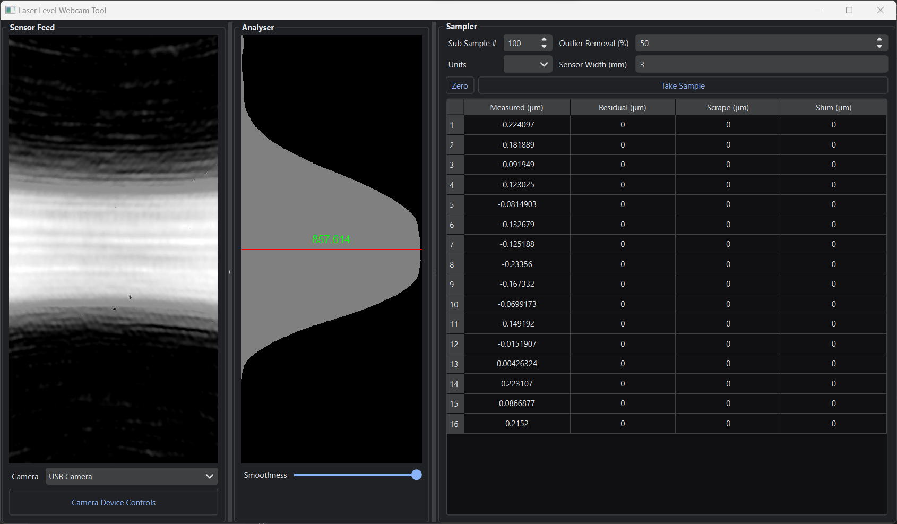

# LaserVision: Real-time Laser Measurement with a Webcam

This is the software component in building a highly accurate measurement device primarily used in a similar way to a surface plate. Sofar measurements are attainable between 0.5um - 2um in repeated measurements. 

Because of how image sensor technology has progressed, we can use that  as the basis of a highly accurate measurement device. This tool works by reading the laser sensor’s intensity values on a webcam with its camera lens taken off.  An image sensor off a typical $15 webcam is about 3mm wide and has a resolution of FHD (1920x1080). This means that each light sensor is in the range of 1-5 microns in size. 

The camera sensor is mounted at 90 degree angle so the wide direction is vertical. This gives a high coverage to sense the beam and also rescues power source based noise like PWM noise in switching power supplies. 

The laser beam can be a point or a preferred horizontal line (like in a self leveling laser that I am using). We take the mean of each row (ex 1080 pixels wide) reshaping the 2D image into a 1D array. We then take this 1D array and fit a gaussian curve to it to find the center point. Finally converting the pixel position into physical height from calculations based on the physical size of the sensor to its resolution.

Further improvements reaching sub-pixel noise can be done by multisampling the results, smoothing out the luminosity noise in the 1D array, and removal of outliers by percentage. 

This tool is based on the hard work of this original [Java tool](https://github.com/betzuka/laserlevel) but using a different base language Python and further changes to improve its accuracy and usability, and sample speed. 

## Running the compiled binary
Currently please see the [zipped binary file builds folder](builds\Laser_Level_Webcam.zip) for pre compiled binaries using the nuitka
Python to C compiler. In the future I’ll setup a Releases. 

## Running from Python source

1. Install Python on your computer. You can download the latest version of Python from the official website: https://www.python.org/downloads/

2. Clone this repository or download the ZIP file and extract it to a folder on your computer.

3. Open a terminal or command prompt and navigate to the folder where you extracted the files.

4. Install the required packages by running the following command:

`pip install -r requirements.txt`

This command will install all the required packages listed in the `requirements.txt` file.

5. Once the packages are installed, run the application by running the following command:

`python main.py` from the **laser_level_tool** folder.

This will launch the application and start capturing video from your webcam.

## Usage

I’ll make a video explaining this tool and the workflow in greater detail, but in the meantime, work from the left to the right of the tool. Some helpful tips:

- About 100 sub-samples. I tried up to 1000 sub-samples and didn’t find much more of a difference.
- remove 50% of the outliers 
- crank the smoothing way up
- let the tool stay on for at least 5 minutes so the webcam sensor stays at a consistent temp. It will drift while getting up to temp. It might be best to test this on your own sensor by taking the same measurement from a cold start and time how long it takes before the samples stop drifting.
- Make sure nobody is walking around.
- Don’t stand when taking a sample because it’ll pick up your leg muscles. Sit and don’t move.
- Disable auto exposure and auto color temp. Disable anything that says auto in the device config with the extra attribute button (bottom left)

## License

This project is licensed under the GNU Public License 3.0. See the `LICENSE` file for details.
